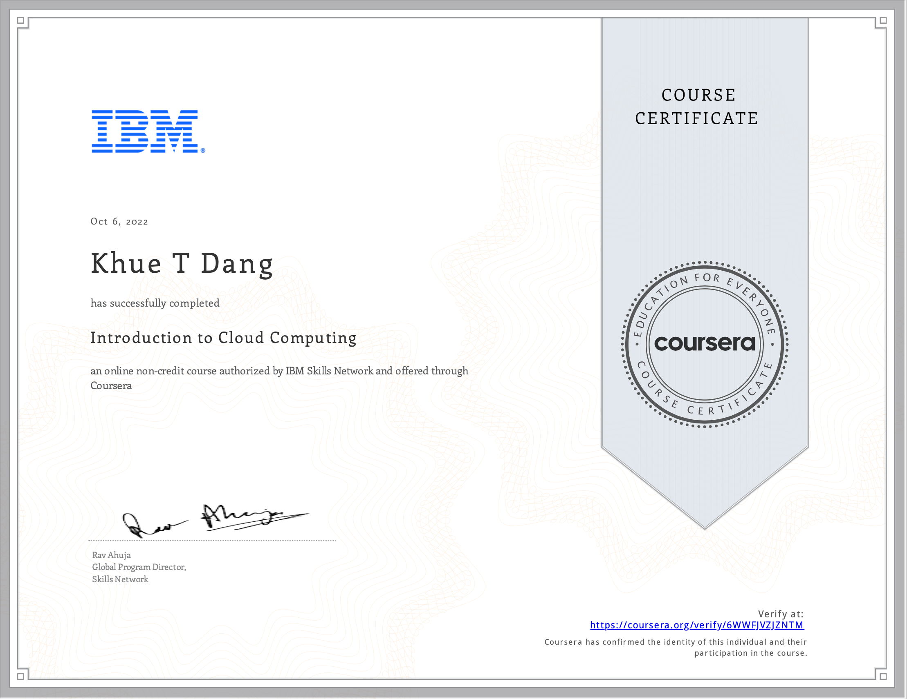

# Introduction to Cloud Computing

- This directory contains all of my assignments from the Coursera Course: [Introduction to Cloud Computing](https://www.coursera.org/learn/introduction-to-cloud)

## Table of Content

- Week 1: [Overview of Cloud Computing](https://github.com/ginny100/IBM-DevOps-and-Software-Engineering/tree/master/Course%202%20-%20Introduction%20to%20Cloud%20Computing/Week%201%20-%20Overview%20of%20Cloud%20Computing)
- Week 2: [Cloud Computing Models](https://github.com/ginny100/IBM-DevOps-and-Software-Engineering/tree/master/Course%202%20-%20Introduction%20to%20Cloud%20Computing/Week%202%20-%20Cloud%20Computing%20Models)
- Week 3: [Components of Cloud Computing](https://github.com/ginny100/IBM-DevOps-and-Software-Engineering/tree/master/Course%202%20-%20Introduction%20to%20Cloud%20Computing/Week%203%20-%20Components%20of%20Cloud%20Computing)
- Week 4: [Emergent Trends and Practices](https://github.com/ginny100/IBM-DevOps-and-Software-Engineering/tree/master/Course%202%20-%20Introduction%20to%20Cloud%20Computing/Week%204%20-%20Emergent%20Trends%20and%20Practices)
- Week 5: [Cloud Security, Monitoring, Case Studies, Jobs and Final Assignement](https://github.com/ginny100/IBM-DevOps-and-Software-Engineering/tree/master/Course%202%20-%20Introduction%20to%20Cloud%20Computing/Week%205%20-%20Cloud%20Security%2C%20Monitoring%2C%20Case%20Studies%2C%20Jobs%20and%20Final%20Assignement)

## Proof of Completion

