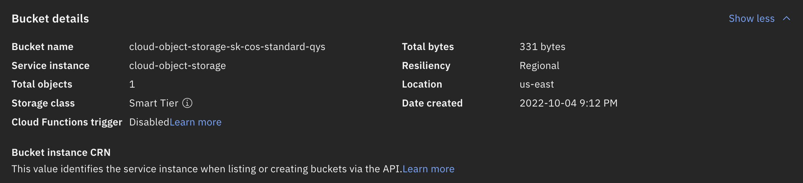

# Create an Object Storage Instance and add items: Final Assignment

1. __Upload a screenshot showing Bucket details__ of a bucket in your instance of Cloud Object Storage. You should have captured this screenshot from Task III Step 1 of the previous hands-on lab. If you were not able to successfully create the Bucket, then upload the SAMPLE IMAGE screenshot above (in which case you will answer the next few questions based on the sample image).

    __TIP:__ If the screenshot appears small and is hard to read try zooming in by pressing "Ctrl" and "+" keys together (Mac: "Command" and "+"), or Right-click on the image and "View Image" (Firefox) or "Open Image in new Tab" (Chrome).

    > Answer: 
    >
    > Bucket details
    >
    > 

2. __Copy and paste the Bucket name__ of the Object Storage Bucket from the screenshot of the Bucket details you uploaded

    > Answer: 
    > 
    > Bucket name: cloud-object-storage-sk-cos-standard-qys

3. __Indicate the Storage Class and Resiliency values__ of the Cloud Object Storage Bucket for which you uploaded the screenshot in Question 1. 

    > Answer: 
    > 
    > Storage class: Smart Tier
    >
    > Resiliency: Regional

4. Recall, from an earlier lesson that Resiliency of Object Storage is selected based on data  protection and access you require. Choose “Cross Region”  to store your data across three regions within a geography for highest  availability and resiliency. Choose “Regional” to store your data across  multiple data center facilities within a single geographic region for  best availability and performance. Choose “Single Data Center” to store  your data across multiple devices in a single data center for when data  locality matters most.

    Similarly, you select Storage Class (or tier) of your Object Storage based on how often you expect to read the stored data, and impacts its cost. For example Choose "Standard" for active workloads.

    __Provide two other possible values for the Storage Class, other than "Standard".__

    > Answer: 
    > 
    > - Vault
    > - Cold Vault
    > - Smart

5. __Share the public URL of the index.html file shared from your Cloud Object Storage Bucket__ (last step in the previous hands on lab). If you were not able to susccessfully share your bucket, please copy and paste the URL value from SAMPLE Submission above.

    > Answer: 
    > 
    > https://cloud-object-storage-sk-cos-standard-qys.s3.us-east.cloud-object-storage.appdomain.cloud/index.html
    