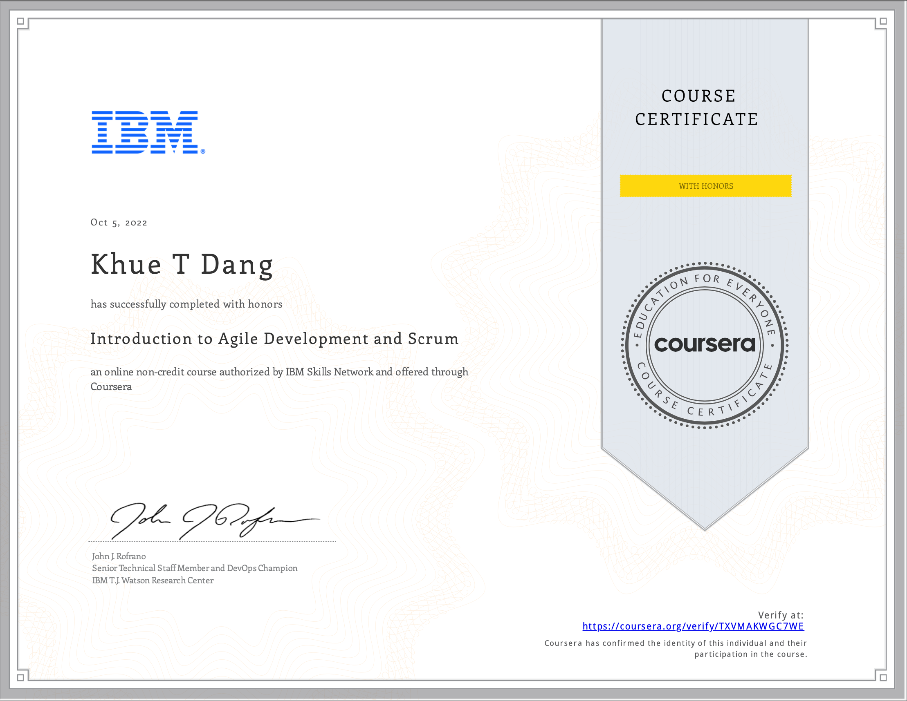

# Introduction to Agile Development and Scrum

- This directory contains all of my assignments from the Coursera Course: [Introduction to Agile Development and Scrum](https://www.coursera.org/learn/agile-development-and-scrum?specialization=devops-cloud-and-agile-foundations)

## Table of Content

- Week 1: [Introduction to Agile and Scrum](https://github.com/ginny100/IBM-DevOps-and-Software-Engineering/tree/master/Course%203%20-%20Introduction%20to%20Agile%20Development%20and%20Scrum/Week%201%20-%20Introduction%20to%20Agile%20and%20Scrum)
- Week 2: [Agile Planning](https://github.com/ginny100/IBM-DevOps-and-Software-Engineering/tree/master/Course%203%20-%20Introduction%20to%20Agile%20Development%20and%20Scrum/Week%202%20-%20Agile%20Planning)
- Week 3: [Daily Execution](https://github.com/ginny100/IBM-DevOps-and-Software-Engineering/tree/master/Course%203%20-%20Introduction%20to%20Agile%20Development%20and%20Scrum/Week%203%20-%20Daily%20Execution)
- Week 4: [[Optional] HONORS Project - Create an Agile Plan with ZenHub](https://github.com/ginny100/IBM-DevOps-and-Software-Engineering/tree/master/Course%203%20-%20Introduction%20to%20Agile%20Development%20and%20Scrum/Week%204%20-%20%5BOptional%5D%20HONORS%20Project%20-%20Create%20an%20Agile%20Plan%20with%20ZenHub)

## Proof of Completion

